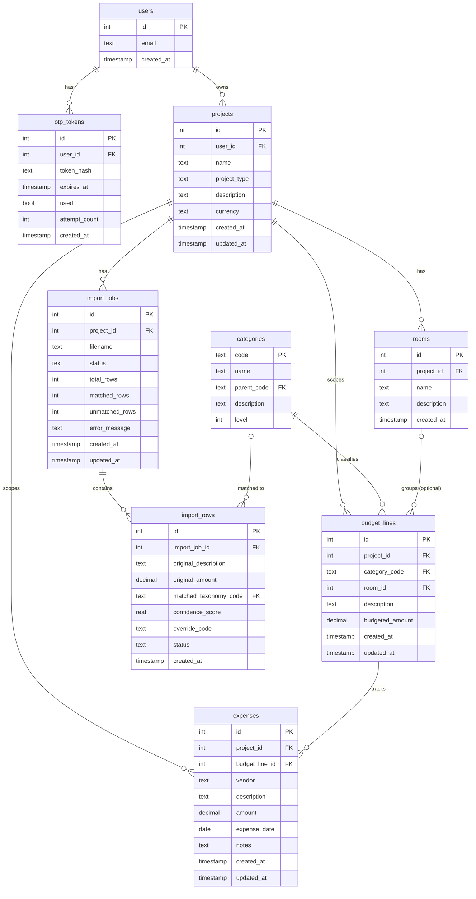

# Data Model

**Producido por:** Mateo — Arquitecto de Datos
**Fecha:** 2026-05-27
**Instrucción:** `ronaldo-files/instructions/006-fase2-modelo-de-datos.md`
**Fuentes:** `deliverables/taxonomy.md`, `reference/03_Expenses.xlsx`, `inicio-proyecto.md`

---

## ERD



---

## Table definitions

### users

| Column | Type | Constraints |
|---|---|---|
| id | INTEGER | PRIMARY KEY AUTOINCREMENT |
| email | TEXT | NOT NULL UNIQUE |
| created_at | TIMESTAMP | NOT NULL DEFAULT CURRENT_TIMESTAMP |

### otp_tokens

| Column | Type | Constraints |
|---|---|---|
| id | INTEGER | PRIMARY KEY AUTOINCREMENT |
| user_id | INTEGER | NOT NULL, FK → users.id ON DELETE CASCADE |
| token_hash | TEXT | NOT NULL — bcrypt hash of the 6-digit code |
| expires_at | TIMESTAMP | NOT NULL — set to created_at + 10 minutes |
| used | BOOLEAN | NOT NULL DEFAULT FALSE |
| attempt_count | INTEGER | NOT NULL DEFAULT 0 — lock after 5 attempts |
| created_at | TIMESTAMP | NOT NULL DEFAULT CURRENT_TIMESTAMP |

### projects

| Column | Type | Constraints |
|---|---|---|
| id | INTEGER | PRIMARY KEY AUTOINCREMENT |
| user_id | INTEGER | NOT NULL, FK → users.id ON DELETE CASCADE |
| name | TEXT | NOT NULL |
| project_type | TEXT | NOT NULL CHECK (project_type IN ('residential', 'commercial')) |
| description | TEXT | |
| currency | TEXT | NOT NULL DEFAULT 'COP' |
| created_at | TIMESTAMP | NOT NULL DEFAULT CURRENT_TIMESTAMP |
| updated_at | TIMESTAMP | NOT NULL DEFAULT CURRENT_TIMESTAMP |

### categories

Populated at application startup from `deliverables/taxonomy.md`. Read-only at runtime — never modified by user actions.

| Column | Type | Constraints |
|---|---|---|
| code | TEXT | PRIMARY KEY — e.g., '01', '01.01', '01.01.01' |
| name | TEXT | NOT NULL |
| parent_code | TEXT | FK → categories.code, nullable (NULL for top-level codes) |
| description | TEXT | |
| level | INTEGER | NOT NULL CHECK (level IN (1, 2, 3)) — derived from dot count + 1 |

### rooms

| Column | Type | Constraints |
|---|---|---|
| id | INTEGER | PRIMARY KEY AUTOINCREMENT |
| project_id | INTEGER | NOT NULL, FK → projects.id ON DELETE CASCADE |
| name | TEXT | NOT NULL |
| description | TEXT | |
| created_at | TIMESTAMP | NOT NULL DEFAULT CURRENT_TIMESTAMP |

### budget_lines

`room_id` is nullable: a line scoped to a specific room gets a value; a project-wide line leaves it NULL.

| Column | Type | Constraints |
|---|---|---|
| id | INTEGER | PRIMARY KEY AUTOINCREMENT |
| project_id | INTEGER | NOT NULL, FK → projects.id ON DELETE CASCADE |
| category_code | TEXT | NOT NULL, FK → categories.code |
| room_id | INTEGER | FK → rooms.id ON DELETE SET NULL, nullable |
| description | TEXT | |
| budgeted_amount | DECIMAL(15,2) | NOT NULL DEFAULT 0 |
| created_at | TIMESTAMP | NOT NULL DEFAULT CURRENT_TIMESTAMP |
| updated_at | TIMESTAMP | NOT NULL DEFAULT CURRENT_TIMESTAMP |

### expenses

`project_id` is denormalized here (redundant with `budget_lines.project_id`) to allow project-scoped queries without joining through `budget_lines`.

| Column | Type | Constraints |
|---|---|---|
| id | INTEGER | PRIMARY KEY AUTOINCREMENT |
| project_id | INTEGER | NOT NULL, FK → projects.id ON DELETE CASCADE |
| budget_line_id | INTEGER | NOT NULL, FK → budget_lines.id ON DELETE RESTRICT |
| vendor | TEXT | |
| description | TEXT | |
| amount | DECIMAL(15,2) | NOT NULL CHECK (amount > 0) |
| expense_date | DATE | NOT NULL |
| notes | TEXT | |
| created_at | TIMESTAMP | NOT NULL DEFAULT CURRENT_TIMESTAMP |
| updated_at | TIMESTAMP | NOT NULL DEFAULT CURRENT_TIMESTAMP |

### import_jobs

A record is created before parsing begins, then updated as processing completes.

| Column | Type | Constraints |
|---|---|---|
| id | INTEGER | PRIMARY KEY AUTOINCREMENT |
| project_id | INTEGER | NOT NULL, FK → projects.id ON DELETE CASCADE |
| filename | TEXT | NOT NULL — original uploaded filename (sanitized, not a path) |
| status | TEXT | NOT NULL DEFAULT 'pending' CHECK (status IN ('pending', 'partial', 'complete', 'failed')) |
| total_rows | INTEGER | NOT NULL DEFAULT 0 |
| matched_rows | INTEGER | NOT NULL DEFAULT 0 — confidence ≥ 0.70 |
| unmatched_rows | INTEGER | NOT NULL DEFAULT 0 — confidence < 0.70 or no match |
| error_message | TEXT | — populated on status = 'failed' |
| created_at | TIMESTAMP | NOT NULL DEFAULT CURRENT_TIMESTAMP |
| updated_at | TIMESTAMP | NOT NULL DEFAULT CURRENT_TIMESTAMP |

### import_rows

One record per data row parsed from the uploaded file. `override_code` is set by the user during the review step.

| Column | Type | Constraints |
|---|---|---|
| id | INTEGER | PRIMARY KEY AUTOINCREMENT |
| import_job_id | INTEGER | NOT NULL, FK → import_jobs.id ON DELETE CASCADE |
| original_description | TEXT | NOT NULL |
| original_amount | DECIMAL(15,2) | — nullable: source row may lack an amount |
| matched_taxonomy_code | TEXT | FK → categories.code, nullable if no match found |
| confidence_score | REAL | — range 0.0–1.0, NULL if unmatched |
| override_code | TEXT | FK → categories.code, nullable — user-selected correction |
| status | TEXT | NOT NULL DEFAULT 'pending' CHECK (status IN ('pending', 'confirmed', 'skipped', 'overridden')) |
| created_at | TIMESTAMP | NOT NULL DEFAULT CURRENT_TIMESTAMP |

---

## Tech-stack decisions

| Component | Choice | Rationale |
|---|---|---|
| Storage (demo) | SQLite 3 | Zero-config, file-based, ships with Python. Sufficient for single-user demo and development. |
| Storage (production) | PostgreSQL 15+ | ACID guarantees, concurrent writes, row-level locking for concurrent expense updates. |
| ORM | SQLAlchemy 2.x | Unified API across SQLite and PostgreSQL. Declarative models map cleanly to table definitions above. No raw SQL strings in application code. |
| Web framework | Streamlit ≥ 1.30 | Specified in `inicio-proyecto.md`. Native support for `st.file_uploader`, `st.data_editor`, `st.session_state`. |
| Email / OTP | SendGrid API (primary), SMTP fallback | SendGrid provides reliable delivery and is configurable via a single API key in `st.secrets`. SMTP fallback covers self-hosted deployments. |
| Python | ≥ 3.10 | Required for `match` statements and `X \| Y` type union syntax. |
| i18n | JSON dictionaries + `t()` helper in `app/i18n.py` | Flat JSON files (`translations/es.json`, `translations/en.json`) are easy to edit without code changes. Adding a third language requires only a new JSON file. Keys are dot-notation slugs (e.g., `nav.projects`). |
| File parsing | openpyxl (`.xlsx`, `.xls`) + pandas (`.csv`, data manipulation) | openpyxl reads .xlsx without requiring a full Office install. pandas handles CSV encoding edge cases (UTF-8 / latin-1 fallback) and provides DataFrame operations for column auto-detection. |
| Fuzzy matching | rapidfuzz | Pure-Python Levenshtein / token-sort implementation. `fuzz.token_sort_ratio` handles Spanish descriptions with different word ordering (e.g., "compra de lote" vs "lote compra"). Significantly faster than fuzzywuzzy. |
| Token hashing | passlib + bcrypt | OTP tokens are stored as bcrypt hashes. Plain token is never persisted. |

---

## Repository structure

```
project/
├── app/
│   ├── main.py              — entry point, st.navigation router
│   ├── auth.py              — OTP generation, email dispatch, verification, session
│   ├── db.py                — SQLAlchemy engine, session factory, ORM models
│   ├── projects.py          — project CRUD, project switcher logic
│   ├── budget.py            — budget line CRUD, category lookup
│   ├── expenses.py          — expense CRUD, validation
│   ├── reports.py           — planned vs. actual charts, variance table, export
│   ├── i18n.py              — t(key) helper, language toggle
│   └── import/
│       ├── __init__.py
│       ├── parser.py        — file type detection, openpyxl/.csv parsing
│       ├── matcher.py       — rapidfuzz taxonomy matching, confidence scoring
│       └── review.py        — import preview UI (st.data_editor), confirmation flow
├── translations/
│   ├── es.json              — Spanish UI strings (all keys present)
│   └── en.json              — English UI strings (all keys present)
├── .streamlit/
│   └── secrets.toml.example — placeholder values, committed to repo
├── .gitignore               — excludes .streamlit/secrets.toml, .env, *.db, __pycache__/
├── requirements.txt
└── README.md
```

---

## Validation against `reference/03_Expenses.xlsx`

`reference/03_Expenses.xlsx` contains 1 sheet ("Sheet1"), 54 rows, 8 columns. Column headers are sparse (many None). The file represents a single real project's soft and hard costs.

| Source column | Source header / content | Maps to | Notes |
|---|---|---|---|
| A | Vendor / contractor name | `expenses.vendor` | Free text; also used as description when column B is the only category |
| B | Expense category (e.g., "Legal", "Engineering", "Utilities - Gas") | `categories.code` via taxonomy lookup | These are the strings the import matching engine must normalize against taxonomy names |
| C | Contract Amount | `budget_lines.budgeted_amount` | Absent for soft-cost rows (no contract) — those lines would have budgeted_amount = 0 or estimated amount |
| D | Paid to Date | `expenses.amount` (aggregate) | Stored as individual expense records; "Paid to Date" is a derived sum |
| E | (unnamed — appears in some rows as an intermediate subtotal) | Not stored | Appears to be a duplicate of column D in some rows; treated as derived/display-only |
| F | Balance Due | Derived: `budget_lines.budgeted_amount − SUM(expenses.amount)` | Not stored; computed at query time |
| G | Notes (e.g., "*6K Retainer", "*5K Retainer") | `expenses.notes` | Free text |
| H | (empty in all rows) | Not mapped | |

### Open questions

| OQ | Description | Blocking |
|---|---|---|
| OQ-DM-01 | Column E appears to duplicate Paid to Date in some rows (e.g., row 28: 739,148 in col D, 754,166 in col E). This may represent a payment-to-date checkpoint vs. a billed-to-date figure. Clarification needed before defining a `billing_amount` column on `expenses`. | No — omit column E for now; revisit if the import engine encounters it |
| OQ-DM-02 | "Total Contracted Amounts" (row 30) and "Total Soft/Admin Paid" (row 16) are subtotals in the source file. The import parser must detect and skip summary rows. Recommend filtering rows where column A is None and column B starts with "Total". | No — handled in parser.py logic |

---

## Seed data note

The `categories` table must be populated at first startup from `deliverables/taxonomy.md` (99 items, 3 levels). A seed script (`db.py` or a `seed_categories.py` utility) should read the taxonomy Markdown table and `INSERT OR IGNORE` each row. This is idempotent — safe to re-run.
